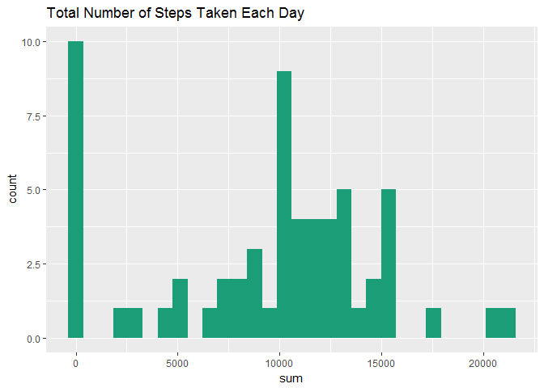
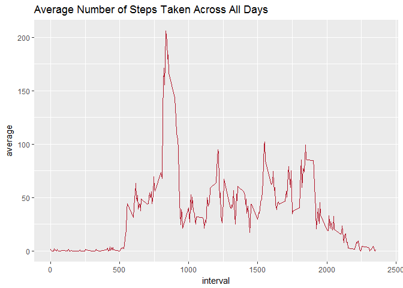
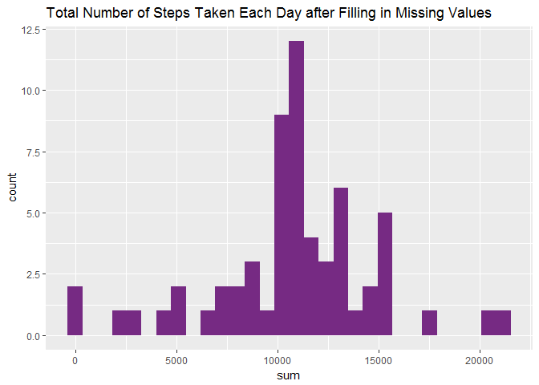
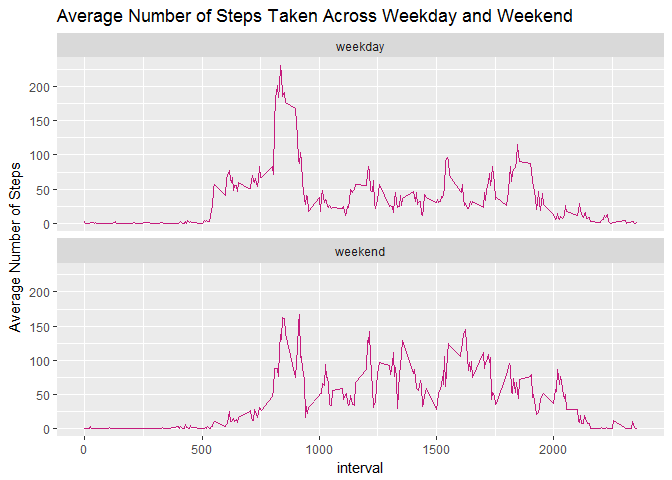

## Loading and preprocessing the data

Set working directory and library packages


```r
setwd("D:/Coursera")
library(RColorBrewer)
library(ggplot2)
library(knitr)
library(dplyr)
```

Load the data to a local file and unzip the data


```r
fileURL<-"https://d396qusza40orc.cloudfront.net/repdata%2Fdata%2Factivity.zip"
download.file(fileURL,destfile = "./Activity.zip")
listZip<-unzip("./Activity.zip")
```

Read the data


```r
activity<-read.csv("activity.csv")
```

## What is mean total number of steps taken per day?

Calculate the total number of steps taken per day and make a histogram of the total number of steps taken each day


```r
daysum<-summarize(group_by(activity,date),sum=sum(steps,na.rm = T))
gsum<-ggplot(data=daysum,aes(sum))
gsum+geom_histogram(bins=30,fill=colorRampPalette(brewer.pal(3,"Dark2"))(1))+ggtitle(label = "Total Number of Steps Taken Each Day")
```

<!-- -->

Calculate and report the mean and median of the total number of steps taken per day


```r
stepmean<-round(mean(daysum$sum),2)
stepmean
```

```
## [1] 9354.23
```

```r
stepmedian<-median(daysum$sum)
stepmedian
```

```
## [1] 10395
```

The mean of the total number of steps taken per day was 9354.23 and the median was 10395

## What is the average daily activity pattern?

Make a time series plot of the 5-minute interval (x-axis) and the average number of steps taken, averaged across all days (y-axis)


```r
interaver<-summarize(group_by(activity,interval),average=mean(steps,na.rm = T))
gaver<-ggplot(data=interaver,aes(x=interval, y=average))
gaver+geom_line(linetype=1,color=colorRampPalette(brewer.pal(9,"RdGy"))(1))+ggtitle(label = "Average Number of Steps Taken Across All Days")+coord_cartesian(xlim=c(0,2400))
```

<!-- -->

Which 5-minute interval, on average across all the days in the dataset, contains the maximum number of steps?


```r
maxinterval<-filter(interaver,average==max(interaver$average))[,1]
maxinterval
```

```
## # A tibble: 1 x 1
##   interval
##      <int>
## 1      835
```

## Imputing missing values

Calculate and report the total number of missing values in the dataset


```r
sum(as.integer(is.na(activity$steps)))
```

```
## [1] 2304
```

Create a new dataset that is equal to the original dataset but with the missing data filled in with the mean for that 5-minute interval


```r
actfill<-activity
for(i in seq_len(nrow(actfill))){
  if(is.na(actfill$steps[i])){
    actfill$steps[i]<-as.integer(filter(interaver, interaver$interval==actfill$interval[i])[,2])
  }
}
```

Make a histogram of the total number of steps taken each day


```r
daysumfill<-summarize(group_by(actfill,date),sum=sum(steps,na.rm = T))
gsumfill<-ggplot(data=daysumfill,aes(sum))
gsumfill+geom_histogram(bins=30,fill=colorRampPalette(brewer.pal(9,"PRGn"))(1))+ggtitle(label = "Total Number of Steps Taken Each Day after Filling in Missing Values")
```

<!-- -->

Calculate and report the mean and median total number of steps taken per day


```r
stepmeanfill<-round(mean(daysumfill$sum),2)
stepmeanfill
```

```
## [1] 10749.77
```

```r
stepmedianfill<-median(daysumfill$sum)
stepmedianfill
```

```
## [1] 10641
```

After inputing missing data on the estimates of the total daily number of steps, both mean and median number of steps taken per day was increased. Mean number increased from 9354.23 to 1.074977\times 10^{4} and median number increased from 10395 to 10641

## Are there differences in activity patterns between weekdays and weekends?

Create a new factor variable in the dataset with two levels ¨C ¡°weekday¡± and ¡°weekend¡± indicating whether a given date is a weekday or weekend day


```r
actfillwe<-mutate(actfill,weekday=as.factor(ifelse(weekdays(as.Date(date))=="Sunday","weekend",ifelse(weekdays(as.Date(date))=="Saturday","weekend","weekday"))))
```

Make a panel plot containing a time series plot of the 5-minute interval (x-axis) and the average number of steps taken, averaged across all weekday days or weekend days (y-axis). 


```r
interaverfill<-summarize(group_by(actfillwe,weekday,interval),average=mean(steps,na.rm = T))
gaverfill<-ggplot(data=interaverfill,aes(x=interval, y=average))
gaverfill+facet_wrap(~weekday, nrow=2)+geom_line(linetype=1,color=colorRampPalette(brewer.pal(6,"PiYG"))(1))+ggtitle(label = "Average Number of Steps Taken Across Weekday and Weekend")+labs(y="Average Number of Steps")
```

<!-- -->
